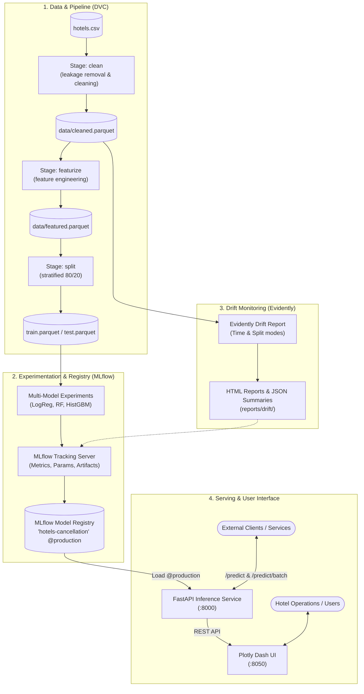

# StaySense ML: Hotel Booking Cancellation Prediction & MLOps Platform

[](https://www.python.org/)
[](https://fastapi.tiangolo.com/)
[](https://dash.plotly.com/)
[](https://mlflow.org/)
[](https://dvc.org/)
[](https://www.docker.com/)
[](https://github.com/astral-sh/ruff)
[](https://github.com/mazwy/StaySenseML/actions)

> Predicts whether a hotel booking will be cancelled, and wraps that model in the pipeline, tracking, serving, and monitoring it needs to stay useful. The aim is practical: fewer surprise no-shows, better-informed overbooking, and a chance to intervene on reservations that look likely to fall through.

---

## Key Capabilities

- **Reproducible data and feature pipeline (DVC)**: Four stages run in order (`clean` $\to$ `featurize` $\to$ `split` $\to$ `train`), with the data versioned at each step. `reservation_status` is dropped up front because it leaks the target. Missing values and feature construction happen inside the pipeline rather than by hand.
- **Experiment tracking and model registry (MLflow)**: Three candidates are compared, **Logistic Regression**, **Random Forest**, and **Histogram Gradient Boosting**. Every run logs its parameters, its metrics (ROC-AUC, Precision, Recall, F1), and its artifacts; whichever wins is registered under the `@production` alias.
- **Drift and distribution monitoring (Evidently AI)**: Compares distributions two ways, either across time using a chronological 80/20 window, or between train and test as a sanity check. Output is an HTML report plus a JSON summary.
- **REST API (FastAPI and Pydantic)**: An async inference service that loads the `@production` model straight from the MLflow Model Registry. It scores one booking at a time through `/predict` or many through `/predict/batch`, and exposes `/healthz` for health checks and `/info` for model metadata.
- **Web dashboard (Plotly Dash)**: Lets a reservation manager change booking attributes and watch the prediction move. Two sample profiles (*Likely Cancel* and *Likely Stay*) come preloaded, and the result shows as a risk gauge with the probability behind it.
- **Containerization (Docker Compose)**: Three services, the MLflow Tracking Server, the FastAPI backend, and the Plotly Dash frontend, brought up together with healthcheck dependencies between them.
- **Continuous integration (GitHub Actions)**: Every push runs **Ruff** for linting and the **pytest** suite.

---

## System Architecture



---

## Repository Structure

```text
.
├── .github/
│   └── workflows/
│       └── ci.yml                 # GitHub Actions CI workflow (lint + test)
├── data/                          # DVC-managed processed datasets (parquet)
│   ├── cleaned.parquet
│   ├── featured.parquet
│   ├── train.parquet
│   └── test.parquet
├── docker/                        # Container build definitions
│   ├── api/
│   │   └── Dockerfile             # FastAPI backend container
│   ├── mlflow/
│   │   └── Dockerfile             # MLflow tracking server container
│   └── ui/
│       └── Dockerfile             # Plotly Dash frontend container
├── models/                        # Baseline serialized pipeline artifacts
│   └── model.joblib
├── reports/                       # Generated metrics and drift audits
│   ├── drift/
│   │   ├── drift_time.html        # Temporal drift visual report
│   │   ├── drift_time.json        # Temporal drift raw metrics
│   │   ├── drift_split.html       # Train/Test baseline drift report
│   │   └── drift_split.json
│   └── metrics.json               # DVC baseline evaluation metrics
├── scripts/                       # CLI helper & pipeline automation scripts
│   ├── mlflow_smoke.py            # MLflow connectivity sanity check
│   ├── run_drift_report.py        # Evidently drift report generator CLI
│   └── run_experiments.py         # Multi-model training & registry promoter
├── src/
│   └── hotels/                    # Core Python package
│       ├── api/                   # FastAPI application & Pydantic schemas
│       │   ├── inference.py       # Model loader & inference wrapper
│       │   ├── main.py            # Route handlers & lifecycle hooks
│       │   └── schemas.py         # Request / Response schemas
│       ├── stages/                # DVC pipeline stage implementations
│       │   ├── _io.py             # Config & path resolution utilities
│       │   ├── clean.py           # Stage 1: clean raw records
│       │   ├── featurize.py       # Stage 2: engineered features
│       │   ├── split.py           # Stage 3: stratified train/test split
│       │   └── train.py           # Stage 4: baseline model training
│       ├── ui/                    # Plotly Dash application
│       │   ├── main.py            # UI layout & interactive callbacks
│       │   └── samples.py         # Preset sample payloads
│       ├── config.py              # Central feature columns & constants
│       ├── data.py                # Data loading, cleaning & filtering logic
│       ├── experiments.py         # MLflow candidate training & model registry
│       ├── features.py            # Feature engineering transformations
│       ├── monitoring.py          # Evidently AI drift detection workflows
│       ├── preprocess.py          # Scikit-learn ColumnTransformer factory
│       └── split.py               # Dataset splitting helpers
├── tests/                         # Pytest test suite
│   ├── conftest.py                # Shared fixtures & sample payloads
│   ├── test_api.py                # FastAPI endpoint & inference tests
│   ├── test_data.py               # Data cleaning & validation tests
│   ├── test_features.py           # Feature engineering tests
│   ├── test_preprocess.py         # Transformer pipeline tests
│   └── test_split.py              # Split stratification tests
├── docker-compose.yml             # Orchestration for MLflow, API & UI
├── dvc.yaml                       # DVC pipeline specification
├── params.yaml                    # Global hyperparameters & artifact paths
├── project.ipynb                  # Exploratory Data Analysis & baseline notebook
└── pyproject.toml                 # Package configuration & dependencies
```

---

## Quickstart

### Method 1: Run with Docker Compose (Recommended)

One command brings up all three services, the MLflow Tracking Server, the FastAPI REST service, and the Plotly Dash UI:

```bash
# Clone the repository
git clone https://github.com/mazwy/StaySenseML.git
cd StaySenseML

# Spin up all services
docker compose up --build
```

#### Service URLs
| Service | URL | Description |
| :--- | :--- | :--- |
| **Plotly Dash UI** | [http://localhost:8050](http://localhost:8050) | Interactive booking cancellation dashboard |
| **FastAPI REST API** | [http://localhost:8000](http://localhost:8000) | Inference service |
| **Swagger Interactive Docs** | [http://localhost:8000/docs](http://localhost:8000/docs) | OpenAPI interactive documentation |
| **MLflow Tracking UI** | [http://localhost:5001](http://localhost:5001) | Experiments, runs, and model registry |

---

### Method 2: Local Python Environment Setup

#### 1. Prerequisites & Virtual Environment
Requires **Python 3.11+** (Python 3.12 recommended).

```bash
python3 -m venv .venv
source .venv/bin/activate

# Upgrade pip and install package with all extras
pip install --upgrade pip
pip install -e ".[notebook,mlflow,dvc,api,ui,monitoring,dev]"
```

#### 2. Run the DVC Data Pipeline
Rerun data preparation, feature engineering, and baseline training:

```bash
dvc repro
```

#### 3. Start the MLflow Server & Run Experiments
Start the tracking server, either in its container or locally:

```bash
# Option A: Start MLflow via Docker Compose
docker compose up -d mlflow

# Run the multi-model comparison experiment (LogReg vs RF vs HistGBM)
python scripts/run_experiments.py
```

#### 4. Run Drift Monitoring
Build drift reports, either across time windows or between train and test:

```bash
# Time-based drift analysis (outputs to reports/drift/)
python scripts/run_drift_report.py --mode time

# Train vs Test split sanity check
python scripts/run_drift_report.py --mode split
```

#### 5. Run the Services Locally
```bash
# Terminal 1: Launch FastAPI Backend
uvicorn hotels.api.main:app --host 0.0.0.0 --port 8000 --reload

# Terminal 2: Launch Plotly Dash Frontend
python -m hotels.ui.main
```

---

## REST API Reference

The service exposes endpoints for health checks, model metadata, and predictions.

### Endpoints Overview

| Method | Endpoint | Description |
| :--- | :--- | :--- |
| `GET` | `/healthz` | Checks API status and active model readiness |
| `GET` | `/info` | Returns registered model name, alias, version, and validation AUC |
| `POST` | `/predict` | Predicts cancellation probability for a single booking |
| `POST` | `/predict/batch` | Batch inference for multiple reservations |

---

### Example: Single Prediction (`POST /predict`)

#### Request
```bash
curl -X POST "http://localhost:8000/predict" \
     -H "Content-Type: application/json" \
     -d '{
       "hotel": "Resort Hotel",
       "lead_time": 87,
       "arrival_date_year": 2025,
       "arrival_date_month": "October",
       "arrival_date_week_number": 40,
       "arrival_date_day_of_month": 3,
       "stays_in_weekend_nights": 0,
       "stays_in_week_nights": 1,
       "adults": 2,
       "children": 0,
       "babies": 0,
       "meal": "BB",
       "country": "PRT",
       "market_segment": "Groups",
       "distribution_channel": "TA/TO",
       "is_repeated_guest": 0,
       "previous_cancellations": 0,
       "previous_bookings_not_canceled": 0,
       "reserved_room_type": "A",
       "assigned_room_type": "A",
       "booking_changes": 0,
       "deposit_type": "Non Refund",
       "agent": 96,
       "company": null,
       "days_in_waiting_list": 0,
       "customer_type": "Transient",
       "adr": 36.05,
       "required_car_parking_spaces": 0,
       "total_of_special_requests": 0
     }'
```

#### Response
```json
{
  "probability_cancelled": 0.942,
  "label": 1,
  "threshold": 0.5
}
```

---

### Example: Service Info (`GET /info`)

```bash
curl -X GET "http://localhost:8000/info"
```

```json
{
  "registered_name": "hotels-cancellation",
  "alias": "production",
  "version": "1",
  "model_kind": "hist_gbm",
  "auc": "0.9248",
  "tracking_uri": "http://localhost:5001"
}
```

---

## Model Evaluation & Benchmarks

`scripts/run_experiments.py` trains every candidate on the same stratified splits and scores them against one held-out test set ($N = 23{,}842$):

| Model Candidate | Algorithm Details | Held-out ROC-AUC | Accuracy | F1 (Cancelled) | Status |
| :--- | :--- | :---: | :---: | :---: | :---: |
| **HistGradientBoosting** | `max_iter=400`, `lr=0.05`, `max_leaf_nodes=63` | **~0.925** | **~86.2%** | **~0.812** | **Production Champion** |
| **Random Forest** | `n_estimators=300`, `min_samples_leaf=2`, `balanced` | ~0.918 | ~85.4% | ~0.801 | Candidate |
| **Logistic Regression** | `penalty=l1`, `solver=liblinear`, `balanced` | ~0.897 | ~81.0% | ~0.753 | Baseline |

Whichever candidate scores highest on ROC-AUC is tagged and promoted to `@production` in the MLflow Model Registry.

---

## Data Drift Monitoring (Evidently AI)

Booking patterns move around: seasonal demand, shifts in customer behavior, different marketing channels. **Evidently AI** handles the drift auditing:

- **Temporal drift (`--mode time`)**: Orders bookings by date and splits them 80% reference to 20% current, approximating how distributions move once a model is live.
- **Split sanity check (`--mode split`)**: Compares train against test to confirm the stratification held.
- **Output Artifacts**:
  - `reports/drift/drift_time.html`: the visual dashboard.
  - `reports/drift/drift_time.json`: the same summary as machine-readable metrics.
  - Both are logged to the MLflow experiment `hotels-drift-monitoring`.

---

## Testing & Code Quality

### Running Tests
Tests cover preprocessing, feature engineering, split stability, and the FastAPI endpoints:

```bash
pytest
```

### Code Formatting & Linting
Enforced via **Ruff**:

```bash
ruff check src/ tests/ scripts/
```

---

## Contributors & Course Context

- **Course**: Data Exploration & Visualization
- **Institution**: Polish-Japanese Academy of Information Technology (PJAIT / PJATK)

---

## License

This project is licensed under the MIT License. See the [LICENSE](LICENSE) file for details.
